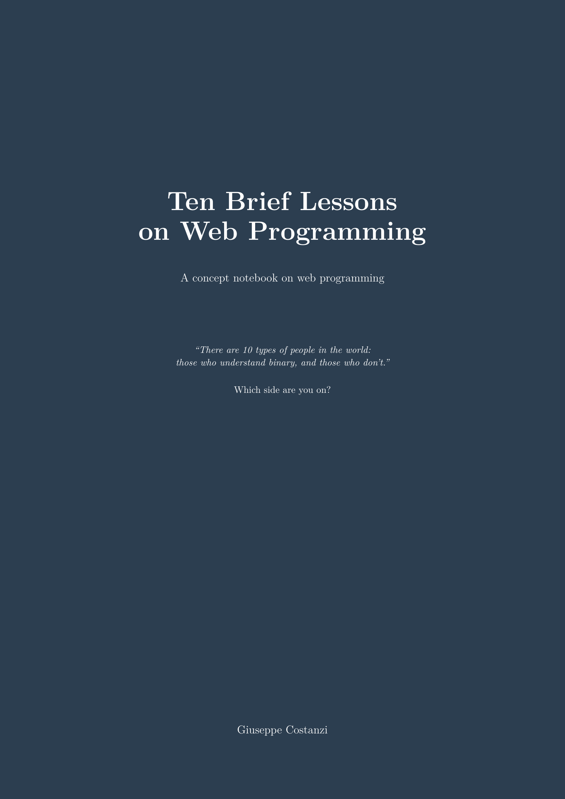

# Ten Brief Lessons on Web Programming

*A concept notebook on web programming*

> *To the next generation of programmers:
> learn to read, write and compute — before it's too late.*

**[Download the book (PDF)](docs/book/ten_brief_lessons.pdf)** — free, open source, ready to print.

Everything else is in the book.

