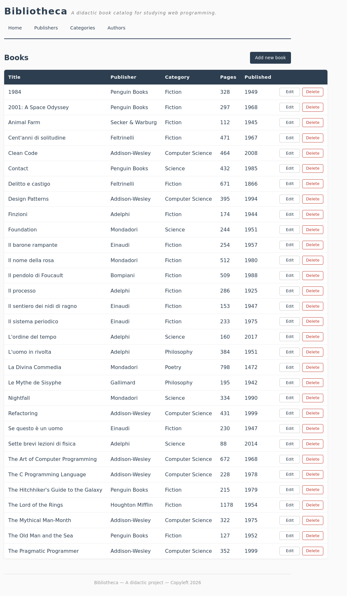

# Bibliotheca

**Ten Brief Lessons on Web Programming**

A didactic web application for studying web programming, built from
scratch with pure PHP, JavaScript, HTML, CSS and SQLite. No frameworks,
no libraries, no magic. Just code.

## What is this?

A book catalog — simple enough to hold in your head, rich enough to
teach you the fundamentals of web development in anno Domini 2026.



## Stack

| Layer    | Technology         |
|----------|--------------------|
| Backend  | PHP (pure)         |
| Frontend | JavaScript (pure)  |
| Markup   | HTML (pure)        |
| Style    | CSS (pure)         |
| Database | SQLite via PDO     |

## Quick start

```bash
sudo apt install apache2 php libapache2-mod-php php-sqlite3
git clone https://github.com/1966bc/bibliotheca.git /var/www/html/bibliotheca
cd /var/www/html/bibliotheca/sql
sudo chgrp www-data . bibliotheca.db
sudo chmod 775 .
sudo chmod 664 bibliotheca.db
```

Open `http://localhost/bibliotheca/public/` in your browser.

## The lessons

| #  | Chapter                                          |
|----|--------------------------------------------------|
| 00 | [Prelude](docs/00_prelude.md)                    |
| 01 | [Introduction](docs/01_introduction.md)          |
| 02 | [Database](docs/02_database.md)                  |
| 03 | [Project Structure](docs/03_structure.md)        |
| 04 | [Backend](docs/04_backend.md)                    |
| 05 | [Frontend](docs/05_frontend.md)                  |
| 06 | [CRUD](docs/06_crud.md)                          |
| 07 | [Validation](docs/07_validation.md)              |
| 08 | [Permissions](docs/08_permissions.md)            |
| 09 | [Debugging](docs/09_debugging.md)                |

## Appendices

| Topic                                        |
|----------------------------------------------|
| [How It Works](docs/how_it_works.md)         |
| [Glossary](docs/glossary.md)                 |

## Conventions

See [CONVENTIONS.md](CONVENTIONS.md) for coding standards and
project rules.

## License

[GPL-3.0](LICENSE)
